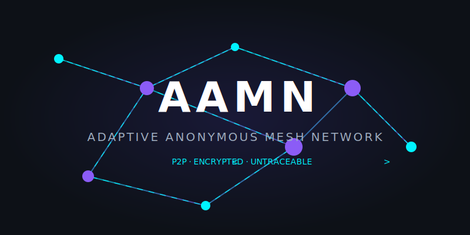

<div align="center">



# AAMN — Adaptive Anonymous Mesh Network

**Next-generation encrypted P2P routing engine written in Rust.**

AAMN is an experimental, open-source framework for building fully anonymous,
end-to-end encrypted peer-to-peer networks. It combines Onion Routing,
the Noise Protocol (IKpsk2), and a Kademlia DHT to ensure that no single node
ever knows both the sender and the destination of a message.

[](https://github.com/Maustral/aamn/actions)
[](LICENSE)
[](https://www.rust-lang.org/)
[](#testing)
[](#status)

[🌐 Website](https://maustral.github.io/aamn) · [📖 Docs](docs/) · [🗺️ Roadmap](#roadmap) · [💬 Discussions](https://github.com/Maustral/aamn/discussions)

</div>

---

## What is AAMN?

AAMN (Adaptive Anonymous Mesh Network) is a protocol engine that lets nodes communicate anonymously over an untrusted network. It is designed for:

- **Privacy-preserving communications** — neither relays nor observers can correlate sender and receiver.
- **Decentralized architectures** — no servers, no central authority, no single point of failure.
- **High-security environments** — every cryptographic primitive is chosen for forward secrecy and modern auditability.

> ⚠️ **Status: Experimental / Early Development.**  
> AAMN is not production-ready. APIs may break between releases.

---

## Features

- 🧅 **Multi-layer Onion Encryption** — ChaCha20-Poly1305 wraps each hop; relays peel only their own layer.
- 🔑 **Noise Protocol IKpsk2** — Mutually authenticated X25519 key exchange with a pre-shared key, providing forward secrecy.
- 🌐 **Kademlia DHT** — Fully decentralized peer discovery with XOR-distance routing and k-buckets.
- 🚦 **Traffic Analysis Protection** — Fixed 512-byte cells and token-bucket rate limiting disguise real traffic.
- ⚡ **QUIC Transport** — Multiplexed, low-latency connections over the modern QUIC protocol with TLS 1.3.
- 🔐 **Ed25519 Node Identity** — Cryptographically verifiable node identities with no PKI dependency.
- 📊 **Prometheus Metrics** — Built-in metrics for bandwidth, latency, and peer counts.
- 🦀 **Written in Rust** — Memory safety without a garbage collector; zero unsafe blocks.

---

## Quick Start

### Requirements

- [Rust](https://rustup.rs/) 1.75 or later
- `cargo` (included with Rust)

### Installation

```bash
# Clone the repository
git clone https://github.com/Maustral/aamn.git
cd aamn

# Build in release mode
cargo build --release

# Run your first AAMN node
./target/release/aamn start --port 9000
```

### Basic Usage

```bash
# Start a node on port 9000
aamn start --port 9000

# Start and connect to a bootstrap peer
aamn start --port 9000 --bootstrap 203.0.113.5:9000

# Check node status
aamn status

# Stop the node
aamn stop

# Run with verbose logging
aamn -v start --port 9000
```

---

## Example — Node Configuration

```toml
# aamn.toml — Node configuration file

[network]
listen_port     = 9000
max_peers       = 50
bootstrap_nodes = ["203.0.113.5:9000", "198.51.100.8:9000"]

[security]
psk             = "your-pre-shared-key-here"
min_circuit_len = 3          # Minimum onion hops

[performance]
cell_size_bytes = 512        # Fixed cell size for traffic shaping
rate_limit_rps  = 100        # Requests per second per peer

[logging]
level           = "info"
json            = false
```

---

## Example — Sending an Anonymous Message

```rust
use aamn::{HandshakeManager, OnionEncryptor, NodeIdentity};

#[tokio::main]
async fn main() -> anyhow::Result<()> {
    // Generate node identity
    let identity = NodeIdentity::generate();
    println!("Node ID: {}", hex::encode(identity.node_id()));

    // Perform Noise IKpsk2 handshake with a peer
    let psk = [0u8; 32]; // Use a real PSK in production
    let manager = HandshakeManager::new(&psk);
    let (msg, _state) = manager.initiate_handshake(peer_pubkey)?;

    // Wrap payload in 3 onion layers
    let keys   = [[1u8;32], [2u8;32], [3u8;32]];
    let relays = [[10u8;32],[11u8;32],[12u8;32]];
    let cipher = OnionEncryptor::new(&keys);
    let wrapped = cipher.wrap(b"Hello, anonymous world!", &relays)?;

    println!("Onion-encrypted payload: {} bytes", wrapped.len());
    Ok(())
}
```

---

## Architecture

```
┌──────────────────────────────────────────────────────────────┐
│                         AAMN Node                            │
│                                                              │
│  ┌─────────┐   ┌──────────┐   ┌──────────┐   ┌──────────┐  │
│  │   CLI   │──▶│  Daemon  │──▶│ Handshake│──▶│ Circuit  │  │
│  └─────────┘   └──────────┘   │ (Noise)  │   │ (Onion)  │  │
│                                └──────────┘   └──────────┘  │
│  ┌─────────┐   ┌──────────┐   ┌──────────┐   ┌──────────┐  │
│  │  DHT    │──▶│ Routing  │──▶│ Transport│──▶│ Padding  │  │
│  │(Kademlia│   │  Table   │   │  (QUIC)  │   │  (512B)  │  │
│  └─────────┘   └──────────┘   └──────────┘   └──────────┘  │
│                                                              │
│  ┌─────────────────────────────────────────────────────┐    │
│  │           Cryptographic Primitives                  │    │
│  │  ChaCha20-Poly1305 · X25519 · Ed25519 · BLAKE2      │    │
│  └─────────────────────────────────────────────────────┘    │
└──────────────────────────────────────────────────────────────┘
```

---

## Project Structure

```
aamn/
├── src/
│   ├── main.rs           # CLI entry point
│   ├── lib.rs            # Public library API
│   ├── handshake.rs      # Noise IKpsk2 protocol
│   ├── crypto.rs         # Onion encryption & key management
│   ├── dht.rs            # Kademlia DHT implementation
│   ├── routing.rs        # Circuit routing table
│   ├── circuit.rs        # Onion circuit construction
│   ├── transport.rs      # QUIC transport layer
│   ├── padding.rs        # Fixed-cell traffic shaping
│   ├── rate_limiter.rs   # Token-bucket & sliding-window
│   ├── network.rs        # Global network manager
│   ├── daemon.rs         # Background service manager
│   ├── config.rs         # Configuration (TOML)
│   ├── metrics.rs        # Prometheus metrics
│   ├── logging.rs        # Structured logging (tracing)
│   ├── fragment.rs       # Packet fragmentation/reassembly
│   ├── pow.rs            # Proof-of-work spam prevention
│   ├── protocol.rs       # Wire protocol definitions
│   ├── cli.rs            # CLI argument parser (clap)
│   ├── integration_tests.rs
│   └── fuzzing.rs        # Security fuzz tests
├── docs/
│   ├── INSTALL.md        # Installation guide
│   ├── USAGE.md          # Usage guide
│   ├── API.md            # API reference
│   ├── PROTOCOL.md       # Protocol specification
│   ├── CONFIG.md         # Configuration reference
│   ├── SECURITY.md       # Security model
│   └── ROADMAP.md        # Project roadmap
├── examples/
│   ├── basic_node.rs     # Start a simple node
│   ├── send_message.rs   # Send an anonymous message
│   └── dht_lookup.rs     # Peer discovery example
├── assets/
│   ├── logo.png
│   ├── banner.png
│   └── aamn_hero.svg
├── Cargo.toml
├── LICENSE
└── README.md
```

---

## Roadmap

### v0.2 — Core Protocol *(current)*
- [x] Noise IKpsk2 handshake
- [x] Multi-layer onion encryption (ChaCha20-Poly1305)
- [x] Kademlia DHT peer discovery
- [x] QUIC transport layer
- [x] Fixed-cell padding (512 bytes)
- [x] Token-bucket rate limiting
- [x] CLI (`start`, `stop`, `status`)
- [x] 60 unit + integration tests
- [x] CI/CD (Linux, macOS, Windows)

### v0.3 — Network Hardening *(next)*
- [ ] Full onion circuit construction across 3+ live hops
- [ ] Session key rotation every N packets
- [ ] Guard node selection
- [ ] Bandwidth shaping (constant-rate cover traffic)
- [ ] NAT traversal via STUN/TURN

### v0.4 — Ecosystem
- [ ] SOCKS5 proxy interface
- [ ] gRPC control API
- [ ] Web dashboard (metrics visualization)
- [ ] Docker image
- [ ] Mobile library (iOS/Android via FFI)

### v1.0 — Production
- [ ] External security audit
- [ ] Specification document (RFC-style)
- [ ] Stable API guarantee
- [ ] Performance benchmarks published

---

## Testing

```bash
# Run all unit tests
cargo test --lib

# Run integration tests only
cargo test integration

# Run with verbose output
cargo test -- --nocapture

# Security audit
cargo audit
```

All 60 tests pass across Linux, macOS, and Windows via GitHub Actions CI.

---

## Security

AAMN takes security seriously. Please read our [Security Policy](docs/SECURITY.md) before reporting vulnerabilities.

**Do NOT open a public issue for security vulnerabilities.** Instead, email the maintainers or open a [private security advisory](https://github.com/Maustral/aamn/security/advisories/new).

### Cryptographic Primitives

| Primitive | Algorithm | Purpose |
|---|---|---|
| Symmetric Encryption | ChaCha20-Poly1305 | Onion layer encryption |
| Key Exchange | X25519 | Diffie-Hellman in Noise handshake |
| Signatures | Ed25519 | Node identity verification |
| Hashing | BLAKE2b / SHA-256 | DHT routing, key derivation |
| KDF | HKDF-SHA256 | Session key derivation |
| Transport | QUIC + TLS 1.3 | Authenticated relay connections |

---

## Contributing

Contributions are welcome! Please read [CONTRIBUTING.md](docs/SECURITY.md) first.

```bash
# Fork and clone
git clone https://github.com/YOUR_USERNAME/aamn.git

# Create a feature branch
git checkout -b feat/my-feature

# Make changes, run tests, format
cargo test && cargo fmt && cargo clippy -- -D warnings

# Push and open a Pull Request
git push origin feat/my-feature
```

---

## Philosophy

AAMN is built on three core principles:

1. **Anonymity by architecture** — Privacy should not rely on trusting any single party. The protocol guarantees anonymity even if all but one relay is compromised.
2. **Security by default** — Every connection is encrypted; there is no plaintext fallback. Weak configurations are rejected at startup.
3. **Performance without compromise** — Rust's zero-cost abstractions mean that cryptographic overhead is minimized without sacrificing safety or correctness.

---

## License

AAMN is released under the [MIT License](LICENSE). See `LICENSE` for details.

---

<div align="center">

Built with 🦀 by [Maustral](https://github.com/Maustral) · [⭐ Star this repo](https://github.com/Maustral/aamn)

</div>
